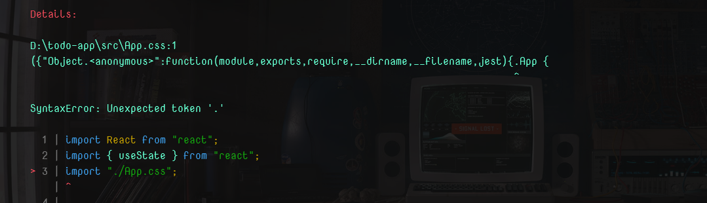
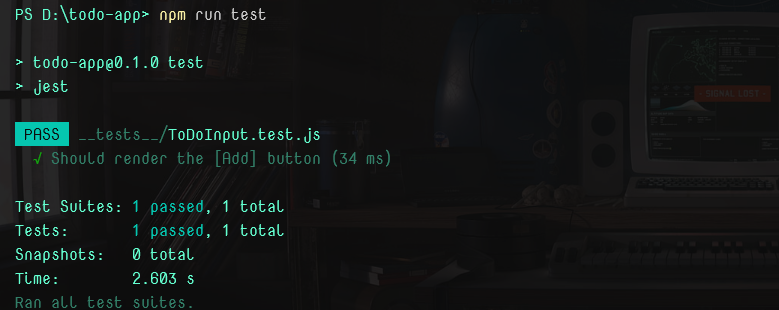

# Week 2: Testing React components

Building a cool React app is exciting! But imagine months down the line, a new feature/change breaks something unexpected.  Testing your React components helps you catch these issues early, keeping your app running smoothly for you and your users.

<!-- more -->
In this blog post, we shall look at common approaches to testing a simple React application using the popular testing library **Jest**. The application we are testing is a simple to-do application hosted [here](https://gitlab.com/nangosha/todo-app) in case you are interested in the source code.

### Demo


### Okay, let's jump in!!

- Install the dependencies

```bash title="install"
# using npm....
npm install jest @testing-library/react @testing-library/user-event @testing-library/jest-dom @babel/preset-react @babel/preset-env --save-dev

#....or using yarn
yarn add -D jest @testing-library/react @testing-library/user-event @testing-library/jest-dom @babel/preset-react @babel/preset-env
```

**Add the following script to your `package.json` file**

```js title="package.json"
"test": "jest"
```

### Don't get scared by the dependencies, I will go ahead and explain what each of them does

- `jest` - this is the most popular testing library for Javascript applications
- `@testing-library/jest-dom` - this provides extensions to jest that allow for testing web applications i.e. the `DOM`
- `@testing-library/react` - this provides the necessary APIs for testing React applications
- `@testing-library/user-event` - this gives us the ability to simulate user actions like clicking, input, gestures, etc.

This is the ToDoInput component that we shall be testing

```js title="ToDoInput.js"
import React from "react";
import { useState } from "react";
import "./App.css";

export const ToDoInput = (props) => {
  const [text, setText] = useState("");
  const { setItems, id, setId, setFinishedItems } = props;

  const deleteItem = (id) => {
    setItems((prevState) => {
      return prevState.filter((item) => item.id !== id);
    });

    setFinishedItems((prevState) => {
      return prevState.filter((item) => item.id !== id);
    });
  };

  const toggleComplete = (id) => {
    setItems((prevState) => {
      // check our items
      let newFinishedItem = prevState.find((item) => item.id === id);
      if (newFinishedItem) {
        // if it is, add it to the finished items
        setFinishedItems((oldState) => [
          ...oldState.filter((item) => item !== newFinishedItem),
          newFinishedItem,
        ]);
        return prevState.filter((item) => item.id !== id);
      } else {
        setFinishedItems((oldState) => {
          let newItem = oldState.find((item) => item.id === id);
          if (newItem) {
            setItems((oldState) => [
              ...oldState.filter((item) => item !== newItem),
              newItem,
            ]);
            return oldState.filter((item) => item.id !== id);
          }
          return oldState;
        });
      }
      return prevState;
    });
  };

  const onSubmit = () => {
    setItems((prevState) => [
      ...prevState,
      {
        id,
        text,
        completed: false,
        toggleComplete,
        deleteItem,
      },
    ]);
    setText("");
    setId(id + 1);
  };

  const handleSubmit = () => {
    if (text) {
      if (props.onSubmit) {
        props.onSubmit();
      } else {
        onSubmit();
      }
    }
  };

  return (
    <div className="ToDoInput">
      <input
        type="text"
        value={text}
        placeholder="Enter a new to-do item"
        onChange={(e) => setText(e.target.value)}
        onSubmit={handleSubmit}
      />
      <button onClick={handleSubmit}>Add</button>
    </div>
  );
};
```

### A simple walk through of the code

We have our main component which contains an `input` and a `button` that are rather self-explanatory. We also have a bunch of functions that are responsible for updating our state i.e the completed items, unfinished items, deleteting items etc.

### Disclaimer

Many times the installed libraries will not work out of the box, so we shall need to a litte setup. Create the following files and add the respective content to them

```js title="jest.config.js"
/** @type {import('jest').Config} */
const config = {
  verbose: true,
  transform: {
    "^.+\\.(js|jsx)$": "babel-jest",
  },
  setupFilesAfterEnv: ["<rootDir>/setup-jest.js"],
  moduleNameMapper: {},
};

module.exports = config;
```

```js title="setup-jest.js"
import '@testing-library/jest-dom';
```

```js title="babel.config.js"
module.exports = {
  presets: ["@babel/preset-react", "@babel/preset-env"],
  plugins: [],
};
```

### The tests

By default, Jest looks for tests in the `__tests__` directory in our root, but of course this can be configured in our jest config file. For this blog, we shall stick to the default. Create a `__tests__` folder and add create the `ToDoInput.test.js` file.

```js title="ToDoInput.test.js"
/**
 * @jest-environment jsdom
 */

import React from "react";
import { render, screen, fireEvent } from "@testing-library/react";
import { ToDoInput } from "../src/ToDoInput";

it("Should render the [Add] button", () => {
  render(<ToDoInput />);
  const addButton = screen.getByText("Add");
  expect(addButton).toBeInTheDocument();
});
```

There are a few things of interest here. We begin by importing the `render`, `screen` and `fireEvent` functions from `@testing-library/react`. `render` allows us to simulate showing the element on the screen, `screen` gives us access to the document tree and `fireEvent` allows us to simulate stuff like clicks and input. This simple test case tests for whether our button element is shown when this component is rendered.

If you ran the test script right now, it would fail with the following error:



This is because jest does not know what do when it meets a `css` file import in our code. We can get around this by *mocking* out `.css` files. This tells jest what to do when it encounters a `.css` file. Same can be done for image imports! Add this line to your `jest.config.js` file, under the `moduleNameMapper` section:

```js title="css mock"
"\\.(css|less|scss|sass)$": "<rootDir>/__mocks__/styleMock.js",
```

Create a file called called `styleMock.js` to the path above and add the following code:

```js title="styleMock.js"
module.exports = {};
```

When you run the test script again, then the tests should run successfully.



<hr>


As shown in the demo above, when the user clicks Submit with an input field, nothing happens. This is intended and we can also go ahead and test for that just to be sure. Add the following test case to our file.

```js title="Empty input does nothing"
it("clicking Add with empty input does nothing", async () => {
  const onSubmitMock = jest.fn();
  render(<ToDoInput onSubmit={onSubmitMock} />);

  const addButton = screen.getByText("Add");

  fireEvent.click(addButton);

  expect(onSubmitMock).toHaveBeenCalledTimes(0);
});
```

Now this is interesting. What does `jest.fn()` even do??? In our component, we can pass an `onSubmit` prop that will get called when the `Add` button is clicked. In our tests, we provide a **`mock`** of that function. Designing a component with mocking in mind makes testing it easier(in my opinion)

So we create a mock of that function, pass it to our component and simulate the clicking event. When the input is empty, we expect our function not to be called. This test passes which goes to show that our component is behaving as expected.

<hr>

On the other hand, we can test that our `onSubmit` function is called when the user input is not empty

```js title="Non-empty input calls onSubmit"
it("clicking Add with non-empty input should call onSubmit", async () => {
  const onSubmitMock = jest.fn();
  render(<ToDoInput onSubmit={onSubmitMock} />);

  const addButton = screen.getByText("Add");
  const inputField = screen.getByPlaceholderText("Enter a new to-do item");

  fireEvent.change(inputField, { target: { value: "Buy milk" } });
  fireEvent.click(addButton);

  expect(onSubmitMock).toHaveBeenCalledTimes(1);
});
```

This test case is very similar to the previous one with the added line of simulating user keyboard input. The user types `Buy milk` before they go ahead to click the Add button. This test passes because `onSubmit` gets called once, which is what we wanted!

<hr>

That's it for our introduction to unit testing in React. In case you are interested in reading more, you can refer to the following links:

- Jest - <https://jestjs.io/>
- Testing React components - <https://jestjs.io/docs/tutorial-react>, <https://www.browserstack.com/guide/unit-testing-of-react-apps-using-jest>
- Jest configuration - <https://jestjs.io/docs/configuration/>
