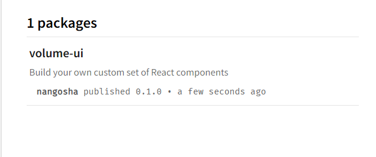

# Week 3: Create a custom React UI components library - Part 1

You have probably heard of Bootstrap, Material UI or even any other custom UI component library for the web. But have you have ever wondered what it would take to pull off something similar?

<!-- more -->

In this post, we shall look at how to create a basic React UI component library.

## What we are going to cover

- How to setup your first basic UI library package with a simple **`Button`** component
- How to package and distribute it on `npm`

## Why would you choose to roll your own UI library?

- In many cases, the decision to make a custom UI library is reached by teams/organisations who have many applications and would like a consistent styling/appearance across all of them.
- This approach also fosters reusability of common UI components across multiple company codebases
- Tailored functionality - A custom UI framework can be tailored to meet the specific needs and requirementsof the company's product and user base. It also allows for inclusion of features that could not be available in off-shelf frameworks.
- Having a custom library in an organisation increases developer productivity since developers who are not CSS "gods" do not have to worry about the CSS specifics. It also decreases the amount of time that it would take new team members to build UIs
- At a personal level, implementing something of this sort would  make for a really interesting project! So if you have the time, why not take it on???

## Let's get started, shall we?

To make this we shall need the following:

- Storybook: Storybook allows us to preview our components locally as we build them, in addition to other interesting customisations. Of course I could have chosen to do something like linking my local directory so that I can try out the changes, but that is more complicated.
- Vite
- React
- Rollup: Rollup compiles/bundles our module so that we can share it to `npm`

How to configure storybook

- Install storybook using `npm i storybook`
- Run `npx storybook@latest init` and follow the prompts

When this command is done, it will add a script to  your `package.json` file that looks something like this: `"storybook": "storybook dev -p 6006 --ci"`
This will allow us run the local storybook server so that we can preview our changes.

It will also generate a `.stories` directory in your root that looks something similar to this:


This folder has the files `main.js` and `preview.js` that will house most of our config

Make the following changes to the `main.js` file

```js title="main.js"
import { join, dirname } from "path";

/**
 * This function is used to resolve the absolute path of a package.
 * It is needed in projects that use Yarn PnP or are set up within a monorepo.
 */
function getAbsolutePath(value) {
  return dirname(require.resolve(join(value, "package.json")));
}

/** @type { import('@storybook/react-vite').StorybookConfig } */
const config = {
  stories: [
    "../src/**/*.mdx",
    "../src/components/**/*.stories.@(js|jsx|mjs|ts|tsx)",
  ],
  addons: [
    // load the storybook plugins. Most of these will be installed you `init`
    // storybook. But if they are not, you can go ahead and install them manually
    getAbsolutePath("@storybook/addon-onboarding"),
    getAbsolutePath("@storybook/addon-links"),
    getAbsolutePath("@storybook/addon-essentials"),
    getAbsolutePath("@chromatic-com/storybook"),
    getAbsolutePath("@storybook/addon-interactions"),
  ],
  framework: {
    name: getAbsolutePath("@storybook/react-vite"),
    options: {},
  },
};
export default config;
```

Storybook will also generate a `stories` folder, but for the purpose of this post, we won't take on that structure. Go ahead and delete it!

Create a folder with this hierachy at the root: `src/components/Button`.
In the Button folder add the following files: `Button.jsx`, `button.css`, `Button.stories.js` and `index.js`
To those files add the following content as show below

```js title="Button.jsx"
import React from 'react';
import PropTypes from 'prop-types';
import './button.css';

const Button = ({ primary, backgroundColor, size, label, ...props }) => {
  const mode = primary ? 'button-primary' : 'button-secondary';
  return (
    <button
      type="button"
      className={['button', `button-${size}`, mode].join(' ')}
      style={backgroundColor && { backgroundColor }}
      {...props}
    >
      {label}
    </button>
  );
};

Button.propTypes = {
  /**
   * Is this the principal call to action on the page?
   */
  primary: PropTypes.bool,
  /**
   * What background color to use
   */
  backgroundColor: PropTypes.string,
  /**
   * How large should the button be?
   */
  size: PropTypes.oneOf(['small', 'medium', 'large']),
  /**
   * Button contents
   */
  label: PropTypes.string.isRequired,
  /**
   * Optional click handler
   */
  onClick: PropTypes.func,
};

Button.defaultProps = {
  backgroundColor: null,
  primary: false,
  size: 'medium',
  onClick: undefined,
};

export default Button;
```

```css title="button.css"
.button {
    font-family: 'Nunito Sans', 'Helvetica Neue', Helvetica, Arial, sans-serif;
    font-weight: 700;
    border: 0;
    border-radius: 3em;
    cursor: pointer;
    display: inline-block;
    line-height: 1;
  }
  .button-primary {
    color: white;
    background-color: #1ea7fd;
  }
  .button-secondary {
    color: #333;
    background-color: transparent;
    box-shadow: rgba(0, 0, 0, 0.15) 0px 0px 0px 1px inset;
  }
  .button-small {
    font-size: 12px;
    padding: 10px 16px;
  }
  .button-medium {
    font-size: 14px;
    padding: 11px 20px;
  }
  .button-large {
    font-size: 16px;
    padding: 12px 24px;
  }
```

```js title="Button.stories.js"
import { fn } from '@storybook/test';
import Button from './Button';

// More on how to set up stories at: https://storybook.js.org/docs/writing-stories#default-export
export default {
  title: 'Example/Button',
  component: Button,
  parameters: {
    // Optional parameter to center the component in the Canvas. More info: https://storybook.js.org/docs/configure/story-layout
    layout: 'centered',
  },
  // This component will have an automatically generated Autodocs entry: https://storybook.js.org/docs/writing-docs/autodocs
  tags: ['autodocs'],
  // More on argTypes: https://storybook.js.org/docs/api/argtypes
  argTypes: {
    backgroundColor: { control: 'color' },
  },
  // Use `fn` to spy on the onClick arg, which will appear in the actions panel once invoked: https://storybook.js.org/docs/essentials/actions#action-args
  args: { onClick: fn() },
};

// More on writing stories with args: https://storybook.js.org/docs/writing-stories/args
export const Primary = {
  args: {
    primary: true,
    label: 'Button',
  },
};

export const Secondary = {
  args: {
    label: 'Button',
  },
};

export const Large = {
  args: {
    size: 'large',
    label: 'Button',
  },
};

export const Small = {
  args: {
    size: 'small',
    label: 'Button',
  },
};
```

```js title="index.js"
export { default } from "./Button.jsx";
```

In your `components` directory add the following file:

```js title="src/components/index.js"
export { default as Button } from "./Button"
```

In your `src` directory add the following file:

```js title="src/index.js"
export * from "./components"
```

Now when you run the storybook script from your package.json file, you should be able to see your components previewed in the browser. Something like this:


And that's it. We have made our first Button component.

## Bundling our library

Install `rollup` and some other plugins using the following command

```shell title="rollup"
npm i --save-dev rollup @rollup/plugin-node-resolve @rollup/plugin-common-js @rollup/plugin-babel rollup-plugin-postcss
```

Create a file called `rollup.config.mjs` at the root of your project and add the following lines. What this file does should be obvious!

```js title="rollup.config.mjs"
import resolve from "@rollup/plugin-node-resolve";
import commonjs from "@rollup/plugin-commonjs";
import babel from "@rollup/plugin-babel";
import postcss from 'rollup-plugin-postcss';

const babelRuntimeVersion = "^7.24.7".replace(/^[^0-9]*/, "");

export default {
  input: "src/index.js",
  // We want our module to have two separate bundles for both ESM and CJS
  output: [
    {
      file: "dist/esm/index.js",
      format: "esm",
      sourcemap: true,
    },
    {
      file: "dist/cjs/index.cjs",
      format: "cjs",
      sourcemap: true,
    },
  ],
  plugins: [
    resolve(),
    postcss({extensions: [ '.css' ]}), // allows us to handle css file imports in our code
    commonjs({ include: ['node_modules/**'] }),
    babel({ // babel does the compiling of jsx files into something rollup can understand
      babelHelpers: "runtime",
      exclude: /node_modules/,
      presets: [
        ["@babel/preset-env", { targets: "defaults" }],
        ["@babel/preset-react", { runtime: "automatic" }],
      ],
      plugins: [
        ["@babel/plugin-transform-runtime", { version: babelRuntimeVersion }],
      ],
    }),
  ],
};
```

Add a script to your package json that will trigger rollup i.e. `"rollup": "rollup --config"`. The `--config` flag tells `rollup` to load the config file.

When you run the script, it should generate the output in the `dist` folder in a hierarchy that looks something like this:


## Publishing the library to **`npm`**

If you do not have an `npm` account, go ahead and create one at <https://www.npmjs.com/signup>

- Login from the command line using `npm login` and follow the prompts
- Run `npm publish`.
That's it. If you follow everything correctly, then you should see your package in your packages list - something like this:



Now you can use your package by running by running `npm i volume-ui` just like any other package

**Side note**: Besides `npm`, you could also choose to publish to Github directly but that is not the scope of this post.

## Important links

- Creating and publishing an npm package: <https://docs.npmjs.com/creating-and-publishing-unscoped-public-packages>
- Using storybook with Vite: <https://storybook.js.org/docs/get-started/react-vite>
- Code: <https://gitlab.com/nangosha/simple-ui>

## What's next?

In next week's blog post, we shall extend our library to include a custom `Card` component similar to that found in Boostrap. <!-- We shalll also add basic tests to our project. --> See you then!!👋🏿👋🏿
