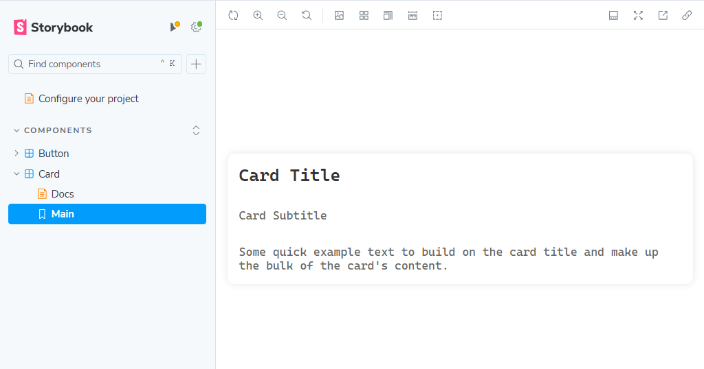

# Week 4: Create a custom React UI components library - Part 2

In this post, we shall go a step further from the basic **`Button`** we created last week and add a new **`Card`** component to our library. <!-- We shall also add basic unit tests -->

<!-- more -->

## What we are going to cover

- How to add a custom `Card` component similar to that found in Boostrap
<!-- - Add tests to make sure that everything is going fine -->

If you have used a library like `react-bootstrap`, then you know that you can use their `Card` component in your UI. It allows different fields like headers, footers, titles, subtitles, text and even images.

A simple example using `react-bootstrap` is shown below

```js title="react-bootstrap card"
<Card style={{ width: '18rem' }}>
    <Card.Body>
    <Card.Title>Card Title</Card.Title>
    <Card.Subtitle className="mb-2 text-muted">Card Subtitle</Card.Subtitle>
    <Card.Text>
        Some quick example text to build on the card title and make up the
        bulk of the card's content.
    </Card.Text>
    <Card.Link href="#">Card Link</Card.Link>
    <Card.Link href="#">Another Link</Card.Link>
    </Card.Body>
</Card>
```

For the sake of brevity, we won't go into `Images`, `Headers`, `Footers`. We shall just focus on the `Title`, `Subtitle` and `Text` for the start

## Let's get started

Create a directory in your `components` folder and call it `Card`. In this new directory, add the following files and their content

```js title="Card.jsx"
import React from "react";
import PropTypes from "prop-types";
import "./card.css";

const CardText = React.forwardRef(
  ({ children, className, as: Component = "p", ...props }, ref) => (
    <Component ref={ref} className={`card-text ${className}`} {...props}>
      {children}
    </Component>
  )
);

const CardSubtitle = React.forwardRef(
  ({ children, className, as: Component = "h6", ...props }, ref) => (
    <Component ref={ref} className={`card-subtitle ${className}`} {...props}>
      {children}
    </Component>
  )
);

const CardTitle = React.forwardRef(
  ({ children, className, as: Component = "h5", ...props }, ref) => (
    <Component ref={ref} className={`card-title ${className}`} {...props}>
      {children}
    </Component>
  )
);

const CardBody = React.forwardRef(
  ({ children, className, tag: Tag = "div", ...props }, ref) => (
    <Tag ref={ref} className={`card-body ${className}`} {...props}>
      {children}
    </Tag>
  )
);

const Card = React.forwardRef(
  ({ children, className, as: Component = "div", ...props }, ref) => (
    <Component ref={ref} className={`card ${className}`} {...props}>
      {children}
    </Component>
  )
);

Object.assign(Card, {
  Title: CardTitle,
  Subtitle: CardSubtitle,
  Body: CardBody,
  Text: CardText,
});

export default Card;

```

**Some important things to note here**

1. Notice our use of `forwardRef`. Given our use case(building a custom UI library), this makes sense for the following reasons:
    - **Component Integration**: Using forwardRef allows our custom components to integrate seamlessly with other React components and libraries that rely on refs.
    - **Direct DOM Manipulation**: It enables users of our library to access the underlying DOM nodes of your components, which is essential for tasks like focusing an input, measuring the size of an element, or integrating with other libraries.
    - **Composable Components**: `forwardRef` allows our custom components to be more composable. Users can wrap our components with other components or HOCs without losing ref access.

```js title="CardDemo.jsx"
// this file allows us to mirror closely how we would want
// our component to be used. Achieving this same behavior inside a storybook
// is proving to be hard at the moment
import React from "react";
import Card from "./Card";

const CardDemo = ({ title, subtitle }) => (
  <Card>
    <Card.Body>
      <Card.Title>{title}</Card.Title>
      <Card.Subtitle>{subtitle}</Card.Subtitle>
      <Card.Text>
        Some quick example text to build on the card title and make up the bulk
        of the card's content.
      </Card.Text>
    </Card.Body>
  </Card>
);

export default CardDemo;

```

```css title="card.css"
.card{
    width: 100%;
    height: 100%;
    display: flex;
    flex-direction: column;
    justify-content: space-between;
    border-radius: 10px;
    box-shadow: 0 0 10px rgba(0, 0, 0, 0.1);
    background-color: #fff;
    transition: all 0.3s;
}

.card-title{
    font-size: 1.5rem;
    font-weight: 600;
    color: #333;
    margin: 0;
    padding: 1rem;
}

.card-subtitle{
    font-size: 1rem;
    font-weight: 400;
    color: #666;
    margin: 0;
    padding: 1rem;
}

.card-text{
    font-size: 1rem;
    font-weight: 400;
    color: #666;
    margin: 0;
    padding: 1rem;
}
```

```js title="Card.stories.js"
import CardDemo from './CardDemo';

export default {
  title: 'Components/Card',
  component: CardDemo,
  parameters: {
    layout: 'centered',
  },
  tags: ['autodocs'],
  argTypes: {
    backgroundColor: { control: 'color' },
  },
};

export const Main = {
  args: {
    title: 'Card Title',
    subtitle: 'Card Subtitle',
  },
};

```

When we preview our `Card` component in our storybook, it should look like this:



## Important links

- Why should we use `forwardRef`: [Blog post](https://medium.com/@kabildeveloper/do-you-really-need-react-forwardref-93b48e9c1fab#:~:text=forwardRef%20is%20a%20function%20in,a%20specific%20child%20component%20instance>.), [This Reddit post](https://www.reddit.com/r/reactjs/comments/q56sph/what_purpose_does_a_ref_serve_in_a_simple_badge/)

## What's next?

Feel free to take motivation from these posts to create your own custom library
