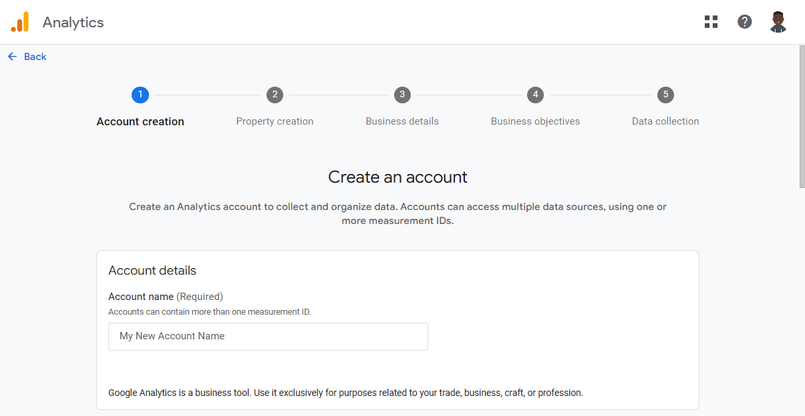
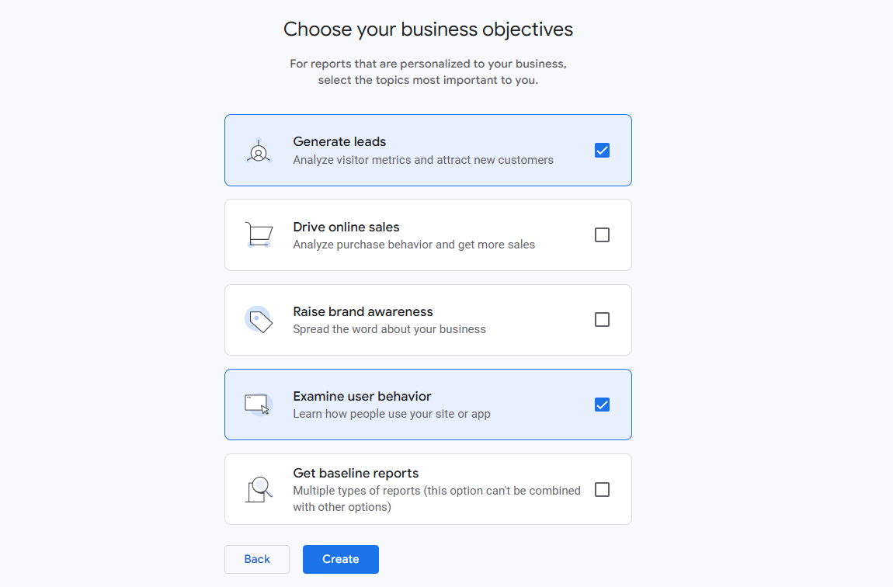
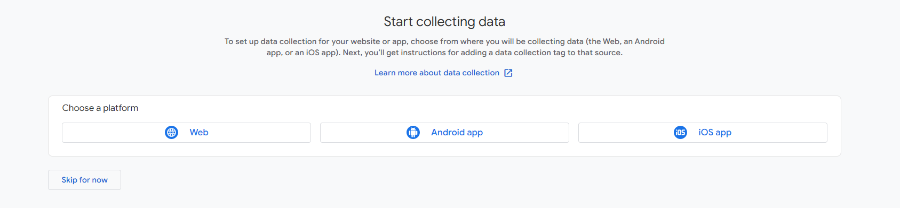
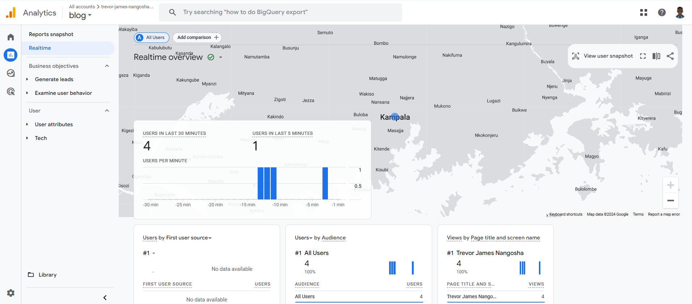

# Week 5: How to add analytics to a website

This week, we shall have an introduction at site analytics, basic terminologies and concepts. In the end we shall look at how to add Google analytics to our site.

<!-- more -->


## Why are we even interested in analytics?
There are many reasons, but I'll give just a few

- **Understanding user behavior**: Analytics help you understand how people use your sites and apps, so you can take action to improve their experience.

- **Monitoring performance**: Track how quickly your pages load and identify slow areas that need improvement.

- **Marketing insights**: Measure the success and effectiveness of marketing campaigns in order to understand which channels drive the most traffic.

- **Audience segementation**: Gain insights into the demographics and interests of your visitors to tailor your content and marketing efforts.

## What are the possible approaches to analytics and web traffic monitoring?

1. **Web Analytics Platforms**: This is the most straightforward approach since it is very popular. One could use tools like Google Analytics, Adobe Analytics etc.
2. **Server log analysis**: One can intergrate log analysis tools like Datadog to get a feel of how their site is being accessed
3. **Content Delivery Network (CDN) Analytics**: These can also provide insights into traffic, performance, and security aspects of your website.
4. **Custom solutions(in-house development)**: Building custom scripts and tools to monitor and analyze web traffic tailored to specific needs.

## Here are some metrics that could be useful depending on your use case

- **Bounce rate** - These are the number of people who leave a site without taking any action i.e. they come, they go!
 A bounce is when someone lands on your site and then leaves from that same page. This is a sign that though the ad or marketing efforts got them there, they weren’t engaged enough to stay.

- **Traffic by source** - Where did this user come from - was it a link, direct typing of URL, marketing etc.
Other common sources of traffic include organic search, social media, email marketing, and paid advertising.

- **Conversion rate** - This indicates whether a user completed the intended action on the page e.g. registering for a newsletter, signing up etc. This is normally a percentage!

- **Average time on page** - This shows the average time that a user spends on a single page

- **Page loading time** - This is exactly what it says!

- **Site visitors** - This is the quantity of traffic your site gets in a given period. It could give an idea of the reach of your site.

- **Unique visitors** - The number of people visiting your site for the first time.


## Why would you want a Google analytics alternative

Google Analytics is the go-to tool when it comes to analytics but there a couple of reasons why one would choose to use something else:

1. **Data Privacy and Control**: Google is notorius for data privacy issues since according to their own terms of service, they mention that "Google and its wholly owned subsidiaries may retain and use, subject to the terms of its privacy policy (located at https://policies.google.com/privacy), information collected in Your use of the Service.” This is a turn off to people who would love to have full control of their users' data
2. **Customization and Flexibility**: Certain tools offer more flexibility in tracking custom events and user behaviors that are specific to your business needs and use cases
3. **Ease of Use**: Some people find Google analytics overwhelming and are looking for something less "bloated"
4. **Compliance and legal issues** - Some countries require that data collected about their citizens be kept within the company's borders. Other countries could also have strict data laws e.g. GDPR, CCPA against sharing user data with third parties.

## Here are some alternatives to Google analytics

- [Matomo analytics](https://matomo.org/)
- [Adobe analytics](https://business.adobe.com/products/analytics/adobe-analytics.html)
- [Plausible analytics](https://plausible.io/)
- [Semrush](https://www.semrush.com/)
- [Simple analytics](https://www.simpleanalytics.com/)

## Add Google analytics to your site

For this blog, I will be adding analytics to this very blog site that you are viewing right now

- **Create an analytics account**: If you have one already, then you are most likely good to go. It could be the case though that you have many seperate apps/websites that you like to track. Or it could so happen that you want to use seperate accounts for say both work and personal. If that's so, then you can proceed to create another account. In my case, I will create a new account.  
Go to `https://analytics.google.com` --> `Admin` --> Click `Create` --> Select `Account`

Here is a sample image from the `Create account screen`


- After you create an account, proceed to create a `property`. A property simply represents the website, mobile app, or device whose data you want to track
- Proceed to describe your business details on the next page
- On the next page, select how you intend to use Google analytics. In my case, I will just click `Examine user behavior` since it looks more fitting. Actually, I will also click `Generate leads`, because why not??

- Click `Create` to finish creating the property
- To start collecting our data, let's choose a platform in our case `web`. This is called a `data stream` and it defines the flow of data from our app/site into our property

- Enter the url of your primary website, in my case `trevor-james-nangosha.github.io`. Give your stream a name. Click `Create stream`

The next step is to set up data collection for our site. There are a couple of ways you can do this, but for the sake of this tutorial we shall add the generated Google tag directly to our pages. Locate your data stream in the console and under `Google tag`, click `View tag instructions`.

Select `Install manually` and you will see a Javascript snippet with yout account's Google tag. Place this tag in the `<head>` tag on each of the pages that you want to track In my case, it is this:

```js title="Google tag"
<!-- Google tag (gtag.js) -->
<script async src="https://www.googletagmanager.com/gtag/js?id=G-GNG4PJ8C5Z"></script>
<script>
  window.dataLayer = window.dataLayer || [];
  function gtag(){dataLayer.push(arguments);}
  gtag('js', new Date());

  gtag('config', 'G-GNG4PJ8C5Z');
</script>
```

- If you have done everything right, then that's it. As per the official docs, data collection may take up to 30 minutes to begin.

Here is a sample screenshot from my reports dashboard after data collection has been activated



## Important links for further reading

1. [How to add Google analytics to site](https://support.google.com/analytics/answer/9304153?hl=en)
2. [How to interpret basic Google analytics reports](https://support.google.com/analytics/answer/9212670?hl=en)
