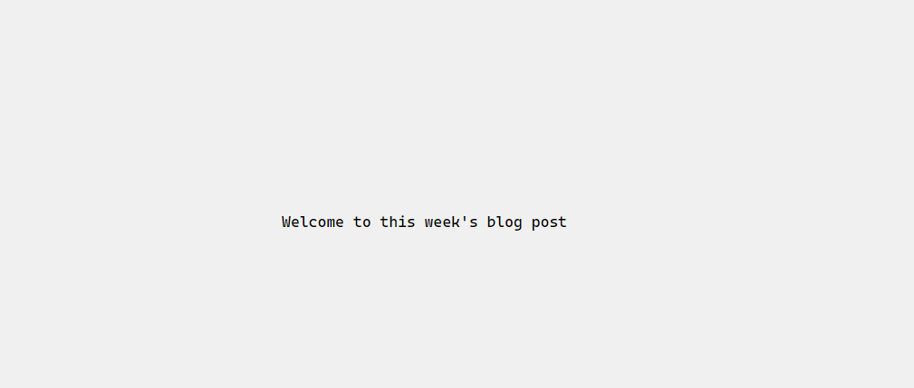

# Week 6: Deploy NGINX inside a docker container

In this week's piece, we shall look at how to deploy a simple website using NGINX......inside a Docker container!

<!-- more -->


## Serve a simple site

1. Let's create a simple website that we shall serve inside our container.
I'll create a directory called `simple-website` and add the following `html` file

    ```html title="index.html"
    <!DOCTYPE html>
    <html lang="en">
    <head>
    <meta charset="UTF-8">
    <meta name="viewport" content="width=device-width, initial-scale=1.0">
    <title>Animation Effect</title>
    <style>
        body {
            display: flex;
            justify-content: center;
            align-items: center;
            height: 100vh;
            margin: 0;
            background-color: #f0f0f0;
        }
    </style>
    </head>
    <body>
    <div class="container">
        <p>Welcome to this week's blog post</p>
    </div>
    </body>
    <script src="index.js"></script>
    </html>
    ```

2. Download the `nginx` docker image from [docker hub](https://hub.docker.com/_/nginx)
    ```shell title="docker-image"
    docker pull nginx
    ```

    You can run `docker images` to view the containers you have on your machine. The image you just downloaded will show among them.

3. Create a `docker-compose.yml` file and add the following content to it.
    ```yaml title="docker-compose.yml"
    services:
        web:
            image: nginx
            container_name: preview
            ports:
            - 80:80
            volumes:
            - /path/to/simple/website:/simple-website
            - /home/nangosha/nginx/default:/usr/share/nginx/html
            - /etc/nginx/sites-available/<config-file-name>.conf:/etc/nginx/conf.d/<config-file-name>.conf
    ```

    Let's walk through what each of these sections of this file does:

    - `services`: `docker-compose` allows one to run multi-container applications. This field allows one to specify the list of the services that will be running in the app. In this case, we have only a single service called `web`
    - `image`: The name of the image that will form this container
    - `container-name`: You can give this container a name, in our case preview
    - `ports`: We get to map some ports from the host machine to docker. In this case, we want all requests to the host on port 80 to be forwared to port 80 of our container.
    - `volumes`: These allow us to make some files/folders on our host machine available to the docker. The changes made to these files are also visible inside the docker container.

        We are mounting the following directories:

        1. We are mounting our website directory to a folder also called `simple-website` inside our container. The target directory name can be anything but we are choosing this for convenience.
        2. We also mount our server blocks file so that it can picked up by nginx


4. Create a server block configuration file. I am working on a Linux system, so the files are normally located at `/etc/nginx/sites-available/`. I am very certain something similar exists for Windows users!
    ```shell title="/etc/nginx/sites-available/simple-website.conf"
    server{
            listen 80;

            server_name testsite.esomelo.com;

            location / {
                root /simple-website;
                index index.html;
                try_files $uri /index.html;
            }
    }
    ```

5. With that out of the way, it's time to start the container.

    ```md title="Tip!"
    On some systems, connections to certain ports will be blocked by the firewall  
    and so we have to make sure that port 80 on our host machine is open.  
    Run `sudo allow 80` to open this port!
    ```

    In the same directory that has you docker-compose file, run `docker-compose up -d`. This will run it in detached mode.

    Run the following command to see if the container is up and running: `docker ps -a`.

    Find the IP address of your host machine and paste ir in your browser. You should see the following page

    

## Add `https` capability to the site.

With the basic stuff out of the way, its time to make sure that our site can be accessed over a more secure protocol