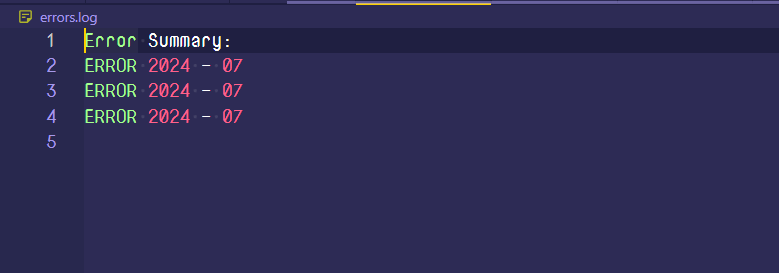
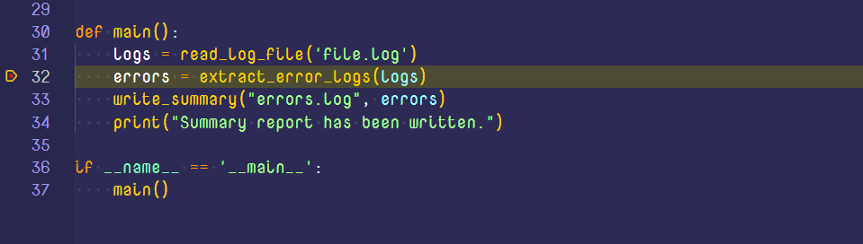
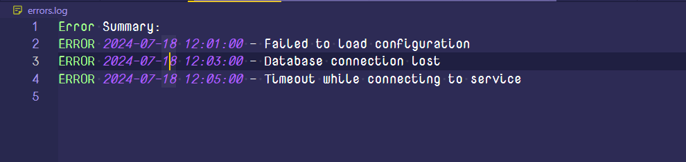

# Week 7: Debugging an application inside VSCode

Debugging is one of those things that took me a long time to figure out. It all seemed like overkill as compared to the humble `print` statment.

<!-- more -->

Nevertheless, I invested some time into learning how to use a debugger, and while I am no debugging expert, I thought that sharing what I learned would be worthwile.  In this article, we shall have an overview about debugging and get our hands dirty by looking at how to debug a simple Python application in VSCode!

## Debugging a simple script

Let's write a simple buggy program and then debug it line by line.
The program below reads in a log file, extracts all the error logs and then prints those extracted logs to a separate file

```python title="log_analyser.py"
def read_log_file(path):
    logs = []
    try:
        with open(path, 'r') as file:
            for line in file:
                print("line: ", line)
    except FileNotFoundError:
        print(f"Error: The file {path} was not found.")

    return logs

def extract_error_logs(logs):
    error_logs = []
    for log in logs:
        if 'ERROR' in log:
            timestamp = log.split('-')[0].strip()
            message = log.split('-')[1].strip()
            error_logs.append((timestamp, message))

    return error_logs

def write_summary(filename, errors):
    try:
        with open(filename, 'w') as file:
            file.write("Error Summary:\n")
            for error in errors:
                file.write(f"{error[0]} - {error[1]}\n")
    except Exception as e:
        print(f"An error occurred while writing to the file: {e}")

def main():
    logs = read_log_file('file.log')
    errors = extract_error_logs(logs)
    write_summary("errors.log", errors)
    print("Summary report has been written.")

if __name__ == '__main__':
    main()
```

If we run the program now, we get the following content written to the `errors.log` file.



This is clearly not what we expected. We certainly have a bug in our program, and it's time to fish it out.

When you read through the code, it seems that the `extract_error_logs()` function is the culprit, so we shall set a breakpoint on the line it's called, as the starting point of our analysis.



Start your debugger by going to the sidebar and select the debug icon or press `(Ctrl + Shift + D)` and select `Run and Debug`

We are interested in the state of the `timestamp`, `message` and `error_logs` variables throughout the program execution, so we shall add them to the watch list.

Step through the `extract_error_logs` program as it runs  and observe the program as it executes. The complete process is shown in the video below:

<iframe width="560" height="315" src="https://www.youtube.com/embed/JRwUDp6Gr1s?si=bi_ijm1phxt2BvPm" title="YouTube video player" frameborder="0" allow="accelerometer; autoplay; clipboard-write; encrypted-media; gyroscope; picture-in-picture; web-share" referrerpolicy="strict-origin-when-cross-origin" allowfullscreen></iframe>

From the video it is very apparent that the way we parse error logs is flawed. With that new information, we can start working towards a solution. This is the corrected version of our function:

```python title="extract_error_logs"
def extract_errors(logs):
    errors = []
    for log in logs:
        if "ERROR" in log:
            parts = log.split(' - ', 1)  # Split on ' - ' only once
            if len(parts) == 2:  # Ensure the split was successful
                timestamp, message = parts
                errors.append((timestamp.strip(), message.strip()))
            else:
                print(f"Malformed log entry: {log}")
    return errors
```

Now our program should be able to run as expected. Here is a sample of our resultant file now



## Stepping through your code

One of the concepts that took me long to understand was the distinction between the debugging functions of `continue`, `step over`, `step into` and `step out`. So I will try to explain them here in a way that I understand them!

1. **continue** - This is the simplest to understand and it means to proceed until the next breakpoint. Very basic, isn't it?
2. **Step over** - Evaluate the current line and move on to the next. If the current line is a function, then execute it and move onto the next line
3. **Step into** - If the current breakpoint is set at a function, then move into that function/gain a focus on that function.
4. **Step out** - Execute the remainder of the function and proceed to the caller

<!-- ## Attaching the debugger to an already running process

Sometimes you may need to debug to a process that was started outside of VSCode. This is where a feature like attaching to that process comes in really handy! -->

## Advanced debugging methods

With the basic stuff of the way, I don't think it would hurt if we took a peek at some of the advanced debugging capabilities of VSCode. I won't go into detail, but I think it would be nice to have an idea of what can be!

1. **Function breakpoints** - these will be set automatically when a certain function is called.
2. **Conditional breakpoints** - These are only triggered when a variable is set to a certain value or value range/only when certain conditions are met
3. **Log points** - This is for the `print` statement warriors. It allows you to set a string that will be printed out when this point of execution in your program is reached!
4. **Remote debugging** - This allows you to debug a program that is running on a remote machine, using a protocol like SSH or any other!
5. **Data breakpoints** - These are triggered only when the value of the specified variable changes!
6. **Attaching the debugger to a process** - Besides debugging the current python script, VSCode's python debugger allows you to hook into a different python process that is running on your host machine!

## Wrapping it all up

The ability to debug well, especially using a debugger is a key tool in the engineer's box. It will not only save you development time, but also make for a better coding experience. At some point, you will realise you can only go so far with the rudimentary **`print()`** statements.

## Important links for further reading

I cannot exhaust all the interesing things you can do with debugging in a single blog post, but only make you aware of what is possible. Here are some links that should provide more comprehensive literature about the whole *"code-sniffing"* process. 

1. [Introduction to VSCode debugging](https://code.visualstudio.com/docs/editor/debugging)
2. [The different ways of stepping through your code](https://learn.microsoft.com/en-us/visualstudio/python/debugging-python-in-visual-studio?view=vs-2022)
3. [Python debugging with pdb](https://realpython.com/python-debugging-pdb/)
4. [Debug a python program that is running inside a container](https://realpython.com/python-debugging-pdb/)
5. [Attach the debugger to an already running process](https://code.visualstudio.com/docs/editor/debugging#_launch-versus-attach-configurations)